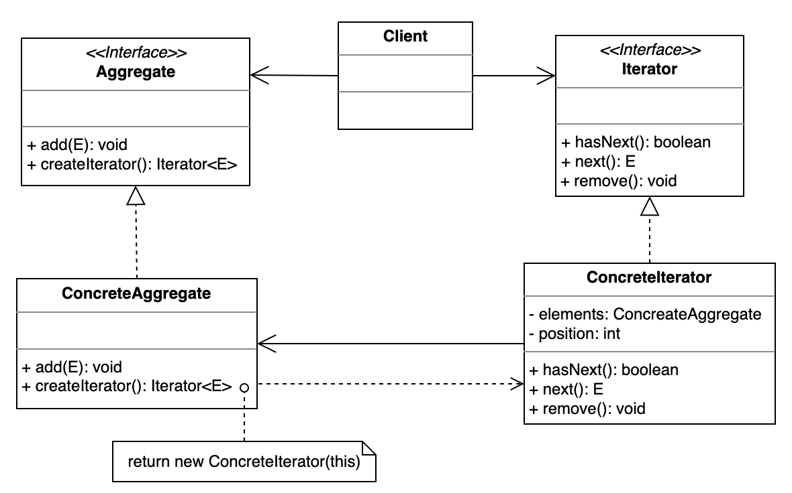

# Iterator 迭代器模式

<!--
封装容器的遍历过程
-->

## 设计目的

> 提供一种方法顺序访问一个聚合对象中各个元素，而又不需暴露该对象的内部表示。

## 解决的问题

想要在遍历和访问聚合内各个元素的同时，不暴露聚合对象的内部结构。

## 设计关键

将对聚合内元素的遍历与访问从聚合对象中抽离出来，单独放入迭代器对象中。

* Aggregate

  对元素进行存储和管理。

  提供创建对应Iterator对象的方法。

* Iterator

  提供遍历和访问聚合对象内元素的方法。

## 类图



## 实现方法

### Iterator

```java
public interface Iterator<E> {
    boolean hasNext();

    E next();

    default void remove() {
        throw new UnsupportedOperationException("remove");
    }
}
```

### ConcreteIterator1

```java
/**
 * List Iterator
 */
public class ConcreteIterator1<E> implements Iterator<E> {
    private List<E> elements;
    private int position = 0;

    public ConcreteIterator1(List<E> list) {
        this.elements = list;
    }

    @Override
    public boolean hasNext() {
        return position < elements.size();
    }

    @Override
    public E next() {
        return elements.get(position++);
    }
}
```

### ConcreteIterator2

```java
/**
 * Array Iterator
 */
public class ConcreteIterator2<E> implements Iterator<E> {
    private E[] elements;
    private int position = 0;

    public ConcreteIterator2(E[] arr) {
        this.elements = arr;
    }

    @Override
    public boolean hasNext() {
        return position < elements.length;
    }

    @Override
    public E next() {
        return elements[position++];
    }
}
```

### Aggregate

```java
public interface Aggregate<E> {
    void add(E element);

    Iterator<E> createIterator();
}
```

### ConcreteAggregate1

```java
/**
 * List Aggregate
 */
public class ConcreteAggregate1<E> implements Aggregate<E> {
    private List<E> elements;

    public ConcreteAggregate1() {
        elements = new ArrayList<>();
    }

    @Override
    public void add(E element) {
        elements.add(element);
    }

    @Override
    public Iterator<E> createIterator() {
        return new ConcreteIterator1<>(elements);
    }
}
```

### ConcreteAggregate2

```java
/**
 * Array Aggregate
 */
public class ConcreteAggregate2<E> implements Aggregate<E> {
    private E[] elements;
    private int position = 0;

    public ConcreteAggregate2(Class<E> type, int size) {
        elements = (E[]) Array.newInstance(type, size);
    }

    @Override
    public void add(E element) {
        if (position >= elements.length) {
            throw new IndexOutOfBoundsException("Aggregate is full!");
        } else {
            elements[position++] = element;
        }
    }

    @Override
    public Iterator<E> createIterator() {
        return new ConcreteIterator2<>(elements);
    }
}
```

### Client

```java
public class Client {
    private Aggregate<Integer> nums;
    private Aggregate<String> strs;

    public Client(Aggregate<Integer> nums, Aggregate<String> strs) {
        this.nums = nums;
        this.strs = strs;
    }

    public void printElements() {
        System.out.println("nums--------");
        printElements(nums.createIterator());
        System.out.println("strs--------");
        printElements(strs.createIterator());
    }

    private void printElements(Iterator iterator) {
        while (iterator.hasNext()) {
            System.out.println(iterator.next());
        }
    }
}
```

## 应用场景

## 工业应用

* Java API中与Iterator以及Collection相关的接口的设计