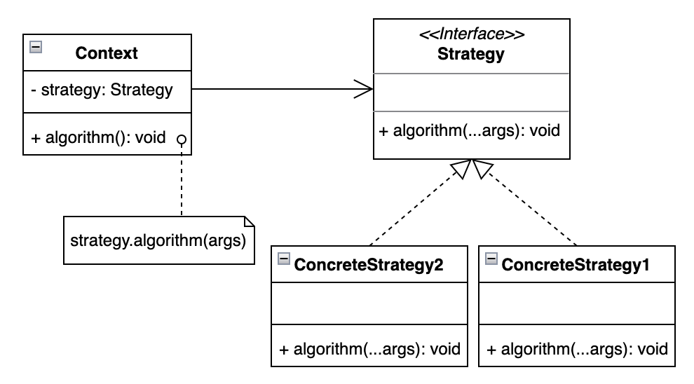

# Strategy 策略模式

## 设计目的

> 定义一系列的算法，把它们一个个封装起来，并且使它们可相互替换。本模式使得算法可独立于使用它的客户而变化。

## 解决的问题

客户在不同的时候需要采用不同的算法(策略)，这些算法需要能够独立于客户端代码而变化，并且算法的增加删减要符合开闭原则。

减少逻辑复杂的if-else语句的使用。

## 设计关键

* Strategy

  封装算法逻辑。

* Context

  调用配置的具体策略类中定义的算法。

## 类图



## 实现方法

### Strategy

```java
public interface Strategy {
    void algorithm();
}
```

### ConcreteStrategy1

```java
public class ConcreteStrategy1 implements Strategy {
    @Override
    public void algorithm() {
        System.out.println("ConcreteStrategy1::algorithm");
    }
}
```

### ConcreteStrategy2

```java
public class ConcreteStrategy2 implements Strategy {
    @Override
    public void algorithm() {
        System.out.println("ConcreteStrategy2::algorithm");
    }
}
```

### Context

```java
public class Context {
    private Strategy strategy;

    public Context(Strategy strategy) {
        this.strategy = strategy;
    }

    public void algorithm() {
        strategy.algorithm();
    }
}
```

## 应用场景

## 工业应用