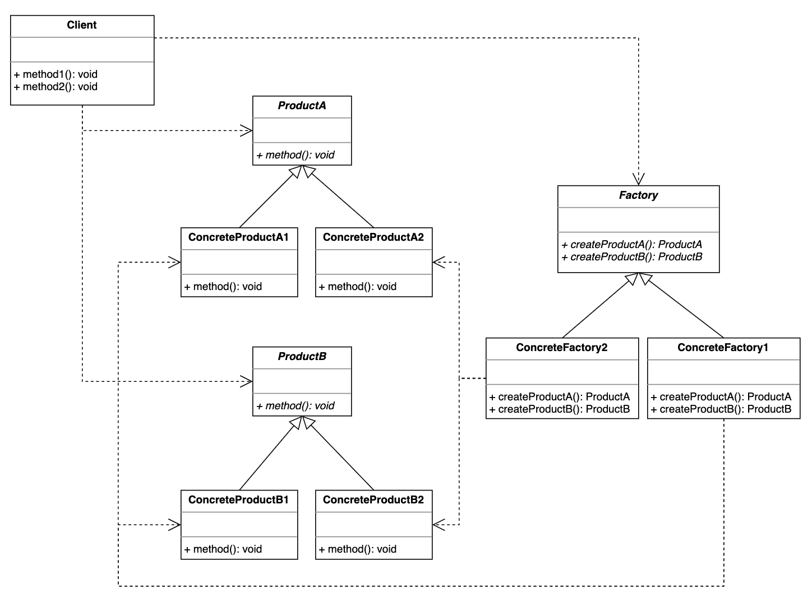

# Abstract Factory 抽象工厂模式

## 设计目的

提供一个创建一系列相关或者相互依赖的对象的接口，而无需指定它们具体的类。

## 解决的问题

工厂方法模式中的每个工厂子类都仅能创建一种特定的产品类，但有时需要每个工厂子类能够创建一系列特定的产品类，而不仅仅只是一种产品类。

例如，西式快餐工厂需要既能生产汉堡又能生产鸡块。KFC工厂需要生产劲脆鸡腿堡和上校鸡块，而金拱门工厂则需要生产芝士牛肉煲和麦乐鸡块。

## 设计关键

* 产品类

  相对于简单工厂模式和工厂方法模式中仅有一种类型的产品类，抽象工厂模式中有多种不同类型的产品类，每个类型下又有不同的产品子类。

* 工厂类

  工厂类里有多个工厂方法，分别对应不同的产品类型，每个方法创建哪个具体的产品子类是由每个工厂子类决定。

## 类图



## 实现方法

### Product

#### ProductA

```java
public abstract class ProductA {
    public abstract void method();
}

public class ConcreteProductA1 extends ProductA {
    @Override
    public void method() {
        System.out.println("ConcreteProductA1::method");
    }
}

public class ConcreteProductA2 extends ProductA {
    @Override
    public void method() {
        System.out.println("ConcreteProductA2::method");
    }
}
```

#### ProductB

```java
public abstract class ProductB {
    public abstract void method();
}

public class ConcreteProductB1 extends ProductB {
    @Override
    public void method() {
        System.out.println("ConcreteProductB1::method");
    }
}

public class ConcreteProductB2 extends ProductB {
    @Override
    public void method() {
        System.out.println("ConcreteProductB2::method");
    }
}
```

### Factory

```java
public abstract class Factory {
    public abstract ProductA createProductA();

    public abstract ProductB createProductB();
}

public class ConcreteFactory1 extends Factory {
    @Override
    public ProductA createProductA() {
        return new ConcreteProductA1();
    }

    @Override
    public ProductB createProductB() {
        return new ConcreteProductB1();
    }
}

public class ConcreteFactory2 extends Factory {
    @Override
    public ProductA createProductA() {
        return new ConcreteProductA2();
    }

    @Override
    public ProductB createProductB() {
        return new ConcreteProductB2();
    }
}
```

### Client

```java
public class Client {
    public void method1() {
        Factory factory = new ConcreteFactory1();
        ProductA productA = factory.createProductA();
        ProductB productB = factory.createProductB();
        productA.method();
        productB.method();
    }

    public void method2() {
        Factory factory = new ConcreteFactory2();
        ProductA productA = factory.createProductA();
        ProductB productB = factory.createProductB();
        productA.method();
        productB.method();
    }
}
```

## 应用场景

## 工业应用