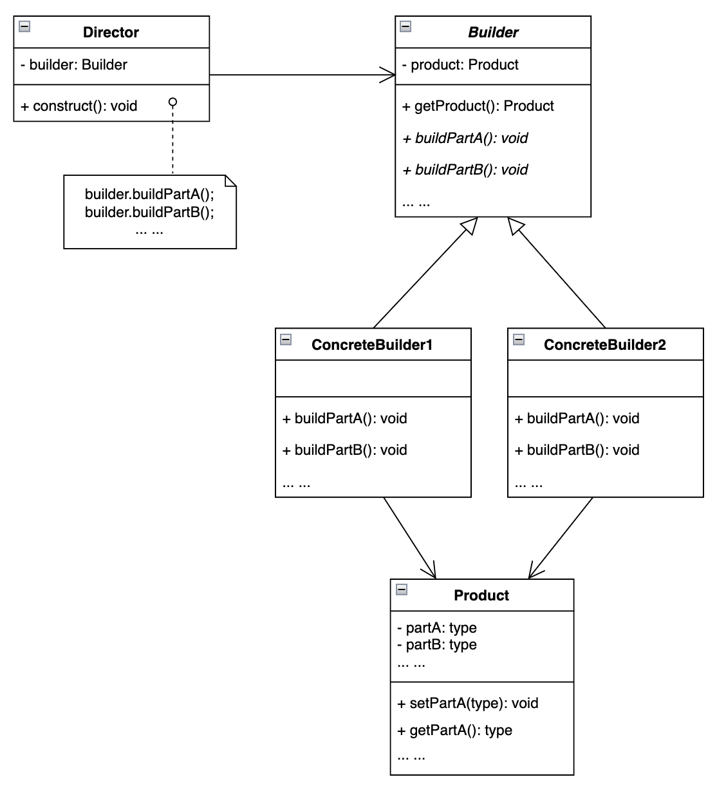

# Builder 建造者模式

## 设计目的

将一个复杂对象的构建与它的表示分离，使得同样的构建过程可以创建不同的表示。

## 解决的问题

与其他的创建型模式相比，建造者模式更注重产品的构建过程，将产品的构建过程和产品的表示分离开来，通过不同的具体Builder实现类来构建同一产品的不同表示。

客户端无需了解构建的过程。

## 设计关键

* Product类

  要构建的对象，结构复杂、属性多，各部分的构建可能需要遵循一定的顺序。

* Builder类

  提供构建产品各部分的方法，存储产品对象，并提供获取产品对象的方法。

* Director类

  调用builder中的方法，按照顺序构建产品的各部分。

### Q&A

Q1：不一定要有一个共同的抽象的product。

## 类图



## 实现方法

### Product

```java
public class Product {
    private int partA;
    private String partB;
    private long partC;

    public Product() {

    }

    public Product(int partA, String partB, long partC) {
        this.partA = partA;
        this.partB = partB;
        this.partC = partC;
    }

    public int getPartA() {
        return partA;
    }

    public void setPartA(int partA) {
        this.partA = partA;
    }

    public String getPartB() {
        return partB;
    }

    public void setPartB(String partB) {
        this.partB = partB;
    }

    public long getPartC() {
        return partC;
    }

    public void setPartC(long partC) {
        this.partC = partC;
    }
}
```

### Builder

```java
public abstract class Builder {
    public Product product;

    public Builder() {
        product = new Product();
    }

    public abstract void buildPartA();

    public abstract void buildPartB();

    public abstract void buildPartC();

    public Product getProduct() {
        return product;
    }
}
```

### ConcreteBuilder1

```java
public class ConcreteBuilder1 extends Builder {

    @Override
    public void buildPartA() {
        product.setPartA(1);
    }

    @Override
    public void buildPartB() {
        product.setPartB("1");
    }

    @Override
    public void buildPartC() {
        product.setPartC(1L);
    }
}
```

### ConcreteBuilder2

```java
public class ConcreteBuilder2 extends Builder {
    @Override
    public void buildPartA() {
        product.setPartA(2);
    }

    @Override
    public void buildPartB() {
        product.setPartB("2");
    }

    @Override
    public void buildPartC() {
        product.setPartC(2L);
    }
}
```

### Director

```java
public class Director {
    private Builder builder;

    public Director(Builder builder) {
        this.builder = builder;
    }

    public void construct() {
        builder.buildPartA();
        builder.buildPartB();
        builder.buildPartC();
    }
}
```

## 应用场景

* 产品内部结构比较复杂；
* 产品属性之间存在依赖关系，即一个属性必须在另一个属性构建之后构建。

## 工业应用