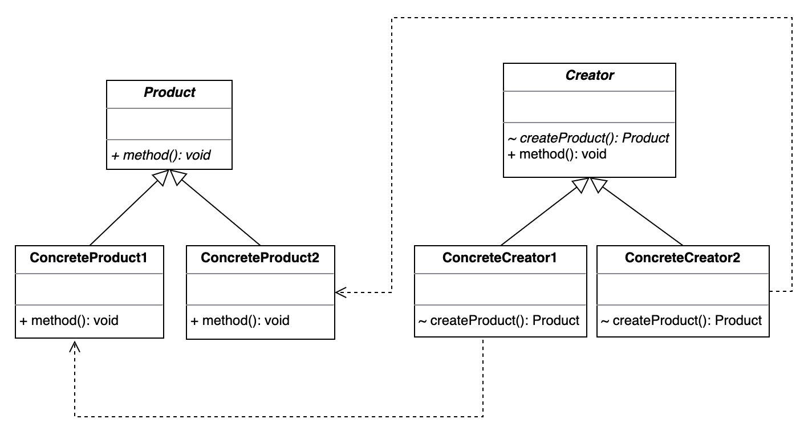

# Factory Method 工厂方法模式

## 设计目的

定义一个用于创建对象的接口，让子类决定实例化哪一个具体类。即将产品类的实例化延迟到工厂类的子类里。

## 解决的问题

在简单工厂模式的基础上，工厂方法模式主要解决了以下问题：

1. 如果产品类发生变化，例如增加一个新的产品类，则必须要修改工厂类的代码。

使用工厂方法模式之后，当增加或删减产品类时，只需要增加或删减对应的工厂子类即可，而不需要做其他的改动。减小了需求变动对代码的影响范围，增加了代码的可维护性。

## 设计关键

将创建对象的代码逻辑从工厂类里抽离出来，对应到每个具体的子类里去实现。

## 类图



## 实现方法

### Product

```java
public abstract class Product {
    public abstract void method1();

    public abstract void method2();
}

public class ConcreteProduct1 extends Product {
    @Override
    public void method1() {
        System.out.println("ConcreteProduct1::method1");
    }

    @Override
    public void method2() {
        System.out.println("ConcreteProduct1::method2");
    }
}

public class ConcreteProduct2 extends Product {
    @Override
    public void method1() {
        System.out.println("ConcreteProduct2::method1");
    }

    @Override
    public void method2() {
        System.out.println("ConcreteProduct2::method2");
    }
}
```

### Creator

这里的Creator结合了Client和Factory，也可以分开写。

```java
public abstract class Creator {
    abstract Product createProduct(); // factory method

    public void method() {
        Product product = createProduct();
        product.method1();
        product.method2();
    }
}

public class ConcreteCreator1 extends Creator {
    @Override
    Product createProduct() {
        return new ConcreteProduct1();
    }
}

public class ConcreteCreator2 extends Creator {
    @Override
    Product createProduct() {
        return new ConcreteProduct2();
    }
}
```

## 应用场景

## 工业应用
