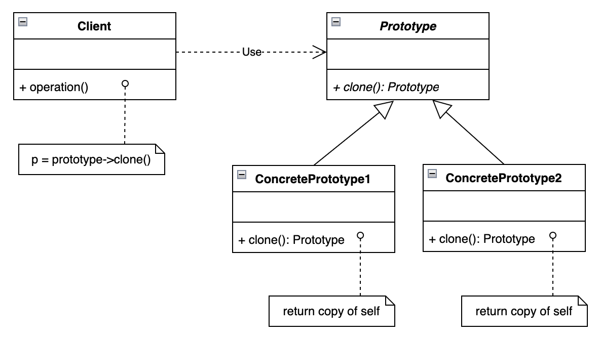

# Prototype 原型模式

## 设计目的

用原型实例指定创建对象的种类，并且通过拷贝这些原型创建新的对象。

## 解决的问题

`前提`

1. 要创建的对象的内部结构比较复杂、构建过程比较繁琐。
2. 同一对象的不同实例之间的内部属性赋值变化不大。
3. 客户端不需要知道如何创建这些实例。

`问题`

1. 如果通过调用全参构造函数来构建实例，代码会非常臃肿。
2. 如果不同的对象数量比较多，给每一个对象都创建一个对应的creator类，不同creator类之间的区别只是创建不同的对象，则会导致程序增加过多的不必要的子类。
3. 如果采用简单工厂模式和调用全参构造函数的方法，则对任一对象内部结构上的改变都会导致工厂类代码的改动。

## 设计关键

用克隆对象代替调用全参构造函数。

* 原型类

实现Cloneable接口，重写clone()方法，实现内部属性的初始化。

* 原型创建类

为每个原型类创建初始的实例，根据传入的参数调用对应实例的克隆方法，返回克隆后得到的对象。

## 类图



## 实现方法

### Prototype

```java
public abstract class Prototype implements Cloneable {
    protected String name;
    protected String description;

    public Prototype() {
        name = "";
        description = "";
    }

    @Override
    public Prototype clone() throws CloneNotSupportedException {
        Prototype copy = (Prototype) super.clone();
        copy.setName(name);
        return copy;
    }

    public void setName(String name) {
        this.name = name;
    }

    public String getName() {
        return name;
    }
}
```

### ConcretePrototype1

```java
public class ConcretePrototype1 extends Prototype {
    private int numOfClones;

    public ConcretePrototype1() {
        numOfClones = 0;
        name = "ConcretePrototype1";
    }

    @Override
    public ConcretePrototype1 clone() throws CloneNotSupportedException {
        ConcretePrototype1 copy = (ConcretePrototype1) super.clone();
        copy.setName(copy.getName() + "-" + (numOfClones++));
        return copy;
    }
}
```

### ConcretePrototype2

```java
public class ConcretePrototype2 extends Prototype {
    private int numOfClones;

    public ConcretePrototype2() {
        numOfClones = 0;
        name = "ConcretePrototype2";
    }

    @Override
    public ConcretePrototype2 clone() throws CloneNotSupportedException {
        ConcretePrototype2 copy = (ConcretePrototype2) super.clone();
        copy.setName(copy.getName() + "-" + (numOfClones++));
        return copy;
    }
}
```

### PrototypeCreator

```java
public class PrototypeCreator {
    private final Prototype concretePrototype1 = new ConcretePrototype1();
    private final Prototype concretePrototype2 = new ConcretePrototype2();

    public Prototype createPrototype(String type) throws CloneNotSupportedException {
        switch (type) {
            case "ConcretePrototype1":
                return concretePrototype1.clone();
            case "ConcretePrototype2":
                return concretePrototype2.clone();
            default:
                return null;
        }
    }
}
```

### Client

```java
public class Client {
    private final PrototypeCreator prototypeCreator = new PrototypeCreator();

    public Prototype createConcretePrototype1() throws CloneNotSupportedException {
        return prototypeCreator.createPrototype("ConcretePrototype1");
    }

    public Prototype createConcretePrototype2() throws CloneNotSupportedException {
        return prototypeCreator.createPrototype("ConcretePrototype2");
    }
}
```

## 应用场景

## 工业应用