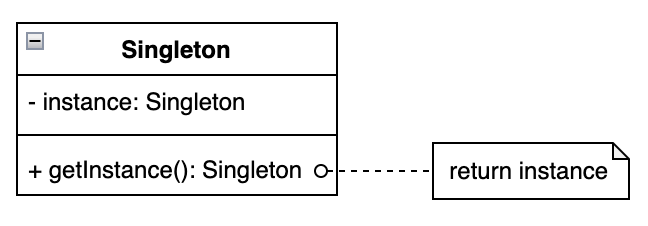

# Singleton 单例模式

## 设计目的

保证一个类仅有一个实例，并提供一个访问它的全局访问点。

## 解决的问题

全局使用的类被频繁地创建和销毁，造成内存资源的浪费。

## 设计关键

* 外部类不能通过单例类的构造函数来创建对象 &rArr; 单例类构造函数应设为private
* 单例类需要为外部类提供获取单例对象的方法 &rArr; 因为外部类不能通过创建单例类对象来调用普通方法，所以只能通过调用类方法来获得实例 &rArr; 方法应设为 public static
* 单例类需要自己创建唯一的单例实例，并在类方法中返回 &rArr; 需要一个私有静态变量来存储该实例 &rArr; 变量应设为 private static

其他同样应该考虑的问题：

1. 线程安全
2. 序列化与反序列化
3. 反射

<!--### 线程安全

### 序列化与反序列化

### 反射-->

## 类图



## 实现方法

通过上述对设计关键的分析，可以得到单例类的初始框架：

```
public class Singleton{
    private static Singleton instance;
    private Singleton(){}
    public static Singleton getInstance(){
        return instance;
    }
}
```

有了初始框架，剩下的就是要添加实例创建部分的逻辑，可以在instance变量声明的同时就创建实例对象(eager)，也可以在getInstance方法被调用时再创建实例对象(lazy)。

单例模式可以有以下六种不同的实现方式：

1. 懒汉式(线程不安全) Lazy loading Thread unsafe
2. 懒汉式(线程安全) Lazy loading Thread safe
3. 饿汉式 Eager
4. 双重校验锁 Double-checked locking
5. 静态内部类 Static inner class
6. 枚举 Enum

### 方法一：懒汉式(线程不安全) Lazy loading Thread unsafe

```java
public class Singleton {
    private static Singleton instance;

    private Singleton() {
    }

    public static Singleton getInstance() {
        if (instance == null) {
            instance = new Singleton();
        }
        return instance;
    }
}
```

**Keys：**

1. 当getInstance方法被调用时才去尝试创建新的对象
2. 尝试创建对象前会先判断对象是否为空

**问题：**

1. 线程不安全
    * 当两个线程同时执行到```if (instance == null)```这一语句时，如果此时instance还未被实例化，则两个线程都会执行```instance = new Singleton()```
      语句来创建对象，最终会产生两个单例对象。因此这种实现方式只适用于单线程环境。

### 方法二：懒汉式(线程安全) Lazy loading Thread safe

```java
public class Singleton {
    private static Singleton instance;

    private Singleton() {
    }

    public static synchronized Singleton getInstance() {
        if (instance == null) {
            instance = new Singleton();
        }
        return instance;
    }
}
```

**Keys：**

1. 在线程不安全懒汉式实现的基础上给getInstance方法添加了synchronized同步锁，保证每次只有一个线程可以访问getInstance方法，从而保证了线程安全。

**问题：**

1. 效率低
    * 这种加锁方式锁的是整个方法，方法内的所有语句都是同步的，这样一个线程必须等待前一个线程完全执行完getInstance方法后才能开始执行该方法。
    * 单例对象未被创建前，同步是必须的，但是单例对象被创建后，```if (instance == null)```语句会返回false，并直接返回实例对象，不会执行对象创建语句。此时同步并不是必须的，在多线程下反而会极大地降低执行效率，因为每个后来的线程还是需要依次排队获取和释放锁才能获得实例对象。

### 方法三：饿汉式 Eager

```java
public class Singleton {
    private static Singleton instance = new Singleton();

    private Singleton() {
    }

    public static Singleton getInstance() {
        return instance;
    }
}
```

**Keys：**

1.与懒汉式相反，饿汉式的实现方法是在类加载时就先创建出单例对象，在getInstance方法被调用时直接将其返回。

**问题：**

1. 浪费内存资源
    * 项目中可能定义了多个单例类，在类加载时就会全部被实例化，但是有的实例可能并不会被用到，但仍会占用内存资源。
2. 如果单例类被多次加载，则会产生多个单例对象

### 方法四：双重校验锁 Double-checked locking

```java
public class Singleton {
    private volatile static Singleton instance;

    private Singleton() {
    }

    public static Singleton getInstance() {
        if (instance == null) {
            synchronized (Singleton.class) {
                if (instance == null) {
                    instance = new Singleton();
                }
            }
        }
        return instance;
    }
}
```

**Keys：**

1. 缩小了同步锁的范围，解决了线程安全懒汉式实现方式效率低的问题。
2. 顾名思义，双重校验锁实现方式会对静态变量进行两次非空验证，并通过添加同步锁来保证线程安全。
    1. 第一次校验，刚进入getInstance方法时，通过判断变量是否为空来确定是否需要进入同步代码块；
    2. 第二次校验，进入同步代码块后，通过判断变量是否为空来确定是否需要创建实例；
    3. synchronized同步代码块缩小同步范围，加的是类锁。
3. 实例变量设为volatile

**Q&A：**

1. 为什么需要两次校验？

   第一次校验比较好理解，是为了减少无意义同步，保证效率。

   第二次校验是为了保证只有一个实例被创建。实例未被创建时，多个线程可能同时到达第一个```if (instance == null)```校验语句，此时实例为空，所以线程都能通过第一次校验进入锁竞争，并且依次获得锁的拥有权执行同步代码块。
   如果没有第二次校验，则能够进入同步代码块的线程都会创建一个新的实例，导致有多个单例实例被创建。

2. 为什么实例变量要设为volatile

   理论上有了两次校验和同步代码块就能在缩小锁范围提高效率的同时保证只有一个单例对象被创建。但其实同步代码块在缩小锁范围的同时也引入了空指针的问题。
   这是因为```instance = new Singleton()```这句创建对象语句并不是原子操作，可以通过javap指令来查看反编译后的字节码：

   ```
   192:dcl aileenwnn$ javac Singleton.java
   192:dcl aileenwnn$ javap -c Singleton.class
   Compiled from "Singleton.java"
   public class GoF.creational.singleton.src.dcl.Singleton {
       public static GoF.creational.singleton.src.dcl.Singleton getInstance();
           Code:
               ...
               17: new           #8                  // class GoF/creational/singleton/src/dcl/Singleton
               20: dup
               21: invokespecial #13                 // Method "<init>":()V
               24: putstatic     #7                  // Field instance:LGoF/creational/singleton/src/dcl/Singleton;
               ...
           Exception table:
               from    to  target type
               11    29    32   any
               32    35    32   any
   }
   ```

   可以看出，创建对象这一操作分为了三步执行：
    1. 创建对象实例，分配内存
    2. 调用构造函数，执行初始化
    3. 将对象引用赋值给变量

   JVM在运行中会对以上指令进行指令重排，指令重排在保证单线程中执行结果不变的前提下，可以提高执行效率。

   指令1并不会发生重排，因为指令2和指令3依赖于指令1的执行结果。但是指令2和指令3之间不存在依赖关系，可能发生指令重排，即指令3可能先于指令2执行。

   因此，可能发生以下情况：
    * 线程1获得了同步锁，执行了指令1和指令3，指令2还未完成；
    * 此时线程2进入getInstance方法，进行第一次校验，因为指令3已经执行，所以变量不为空，直接返回。线程2访问该对象，但由于此时指令2还未执行完成，对象还没有完成初始化，所以可能发生异常。

   volatile关键字主要有两个作用：

    1. 保证被修饰变量在不同线程中的可见性
    2. 禁止指令重排

   因为volatile禁止指令重排，保证了对其修饰的变量的操作指令的执行顺序不会改变，也就避免了上述异常的发生。

   **Note：** 禁止指令重排是在JDK1.5中对volatile关键字的语义增强，所以JDK1.5之前使用volatile并不会解决双重校验锁实现中的问题。

3. 为什么懒汉式(线程安全)不需要使用volatile关键字

   因为锁的是整个getInstance方法，当```instance = new Singleton()```被执行时，其他线程是无法进入getInstance方法的，也就不会得到实例不为空的错误判断。

### 方法五：静态内部类 Static inner class

```java
public class Singleton {
    private Singleton() {
    }

    public static final Singleton getInstance() {
        return SingletonHolder.INSTANCE;
    }

    private static class SingletonHolder {
        private static final Singleton INSTANCE = new Singleton();
    }
}
```

**Keys：**

1. 在单例类中定义一个```私有的静态内部类(private static)```，并在其中定义一个```常量(static final)```用来保存单例对象，对象实例在内部类加载时被创建。
2. 在getInstance方法中直接返回内部类里的常量。

**分析：**

静态内部类实现方式可以很好地解决饿汉式中存在的两个问题，既实现了懒加载，同时也避免了单例类多次加载时会创建多个对象的问题。

这是因为单例类加载的时候内部类并不会一起被加载，而是在第一次被访问时才被初始化，也就是getInstance方法第一次被调用的时候，这样就实现了单例对象的懒加载，并且当单例类被多次加载时，也不会创建多个实例。

<!--TODO 类加载机制远比上述描述的复杂， 详见类加载链接 -->

**Q&A：**

1. 为什么使用内部类？

   因为内部类可以设置为private，而外部类不可以。

2. 为什么内部类要设为private？

   将内部类设为private，这样就保证了只有单例类可以访问该内部类，也就保证了内部类不会在getInstance方法被调用前因被其他外部类访问而导致提前加载，从而保证了实例对象的懒加载。

3. 为什么内部类要设为static？

   普通内部类依赖于外部类且不能拥有静态属性和方法，所以如果要用普通内部类来封装单例对象，则只能通过创建内部类实例的方法来访问。
   而要创建普通内部类对象，就要先创建外部类(单例类)对象，这样在getInstance方法中就需要先创建一个单例类对象，很显然，这样会导致有多个单例实例被创建，不满足单例模式的要求。

   <!--TODO 普通内部类与静态内部类的区别链接-->

4. 为什么静态内部类里的变量要设为static final？

   static是为了使之成为全局变量，避免创建出多个单例对象。试想一下，如果变量不设为static，那么就无法通过```内部类名.变量名```的方式访问它，也就必须通过创建内部类对象访问对象属性的方式来访问。
   这样每次getInstance方法被调用时，都会创建一个内部类对象，每个对象都会有自己的对象属性，彼此之间不共享，从而导致有多个单例对象被创建。

   final是为了保证变量不可变，即不可以被多次赋值。对于引用类型具体来说是指变量初始化后，不可以再指向其他对象，但对象内容可变。
   final在这里并不是必须的，但保留final可以显式地表示该变量应为常量，有助于避免之后因代码改动而带来的潜在问题。

5. 为什么getInstance方法要设为static final?

   static是为了能够在不创建单例对象的前提下通过```类名.方法名```的方式调用单例类里的方法获取单例实例，这也是单例模式的设计关键之一。

   final是为了防止方法被子类重写，并不是必须的，但保留final可以显式地表示该方法不应该被重写，有助于避免之后因代码改动而带来的潜在问题。

6. 静态内部类实现方式是线程安全的吗？为什么？

   静态内部类实现方式是线程安全的，这是由Java的类加载机制来保证的。

   首先，类加载机制保证内部类在真正被访问的时候才进行初始化，这也就保证了单例实例在真正需要的时候才被创建。

   其次，类加载机制保证了在同一个类加载器下，一个类只会被初始化一次。
   JVM会保证被初始化的类的&lt;clinit&gt;()方法在多线程环境中可以被正确地加锁、同步执行。
   这是因为每个类或接口，都有一个唯一的与之对应的初始化锁LC，当多个线程同时去初始化一个类的时候，只有一个线程可以获得这个初始化锁、执行&lt;clinit&gt;()方法。
   其他线程都会进入阻塞状态，等待活动线程执行完&lt;clinit&gt;()方法后被唤醒，被唤醒的线程之后并不会再进入&lt;clinit&gt;()方法。

### 方法六：枚举 Enum

```java
public enum Singleton {
    INSTANCE
}
```

**Keys：**

1. 将单例类声明为enum类型
2. 有且仅有一个枚举项

**分析：**

enum实现方式充分利用了枚举类的特性，实现简单，不仅能保证线程安全，还能防止通过反序列化创建多个实例。

enum类有以下特性：

1. 每个enum类型在编译后都会生成一个与之对应的final的类，并且该类是Enum类的子类，这是由编译器完成的。
2. 每个枚举项在编译后都会生成一个对应的public static final的变量，每个变量都是一个enum类实例对象。
3. enum类的构造器必须是private的，默认构造器也是private的。

**Q&A：**

1. enum实现方式是饿汉式还是懒汉式？为什么？

   enum实现方式是饿汉式的实现方式。
   根据上述enum类的特性可以得知，单例类中定义的唯一的枚举项最终会被编译成类中的静态常量，在类加载过程中实例就会被创建，所以是饿汉式。

2. enum实现方式是如何保证线程安全的？

   因为enum实现方式是饿汉式的，在单例类初始化的过程中就创建出了单例实例。根据静态内部类实现方式Q&A中的分析可知JVM能够保证类的初始化过程是线程安全的，从而也保证了实例的创建是线程安全的。

<!--3. enum实现方式是如何防止通过反序列化创建多个实例的？
4. enum实现方式是如何防止通过反射创建多个实例的？-->

**Notes：**

1. enum是JDK1.5才加入的新特性，所以在JDK1.5之前是无法使用这种方式实现单例模式的。

**问题：**

1. 同饿汉式实现方式一样，enum并不能实现实例的懒加载。

## 应用场景

## 工业应用

* Spring
