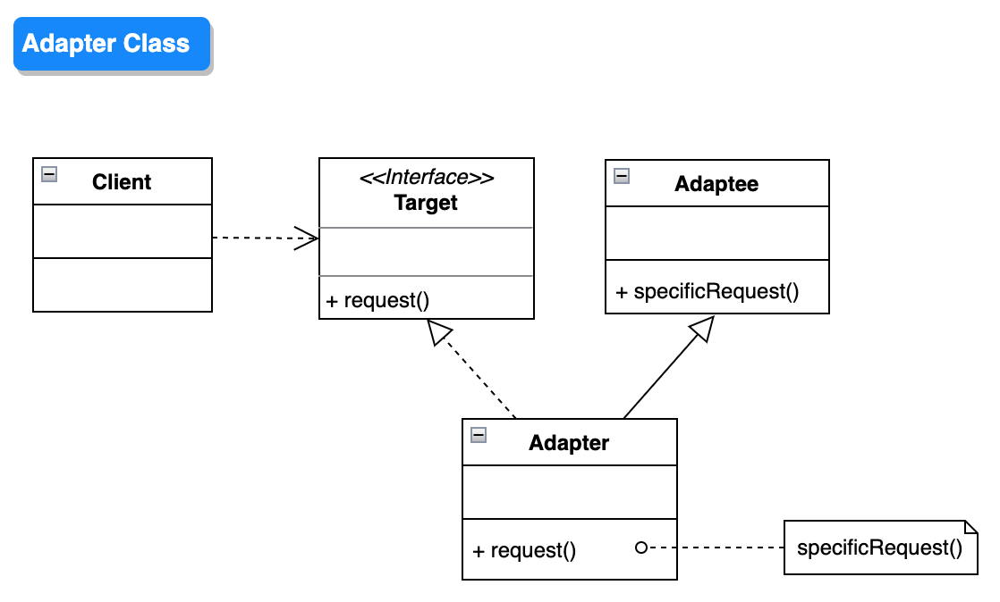

# Adapter 适配器模式

## 设计目的

将一个类的接口转换成客户希望的另外一个接口。Adapter模式使得原本由于接口不兼容而不能一起工作的那些类可以一起工作。

## 解决的问题

* 程序现有的接口与客户的需求不符合；
* 需要兼容不同的接口；
* 如果重构已有接口，则程序内用到该接口的其他地方都要做相应的变动；
* 如果添加新接口，重复实现相同的功能，则会造成代码冗余；
* 不满足开闭原则。

## 设计关键

* Target

  客户需要的接口类型。

* Adaptee

  已有的需要被适配的接口类型。

* Adapter

  将对Target接口的调用转换成对Adaptee接口的调用。

    * 类适配器：通过继承Adaptee类，并调用继承的方法来实现适配。

    * 对象适配器：通过Adaptee对象组合，并调用对象的方法来实现适配。

## 类图




## 实现方法

### Adaptee

```java
public class Adaptee {
    public void specificRequest() {
        System.out.println("Adaptee::specificRequest");
    }
}
```

### Adapter

```java
public class AdapterClass extends Adaptee implements Target {
    @Override
    public void request() {
        super.specificRequest();
    }
}

public class AdapterObject implements Target {
    private Adaptee adaptee;

    public AdapterObject(Adaptee adaptee) {
        this.adaptee = adaptee;
    }

    @Override
    public void request() {
        adaptee.specificRequest();
    }
}
```

### Target

```java
public interface Target {
    void request();
}
```

### Client

```java
public class Client {
    public void adapterObject() {
        Target target = new AdapterObject(new Adaptee());
        target.request();
    }

    public void adapterClass() {
        Target target = new AdapterClass();
        target.request();
    }
}
```

## 应用场景

## 工业应用