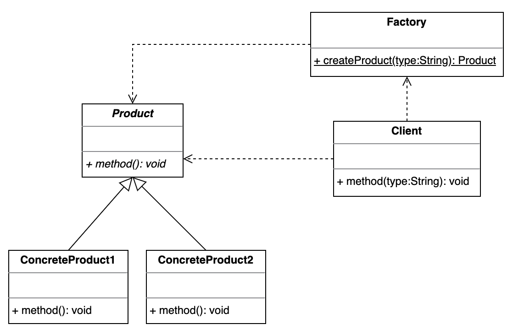

# Simple Factory 简单工厂模式

简单工厂模式也被称为静态工厂模式。严格来说，它并不是一种设计模式，而更像是一种编程习惯。

## 设计目的

将类的实例化代码与对象的使用代码分隔开，使得类的使用者不需要知道具体对象的创建细节就可以获得所需要的对象实例，实现解耦。

## 解决的问题

客户类中需要根据参数使用同一产品抽象类的不同实现。如果将实例的创建逻辑写在客户类中，则会使客户类与产品类之间产生绑定。

1. 如果有多个客户类使用该产品类，则每个客户类都需要知道产品对象的创建细节，并且每个客户类都要实现一遍相同的实例化逻辑，造成代码冗余。
2. 如果产品类发生改变，例如删除了某个产品实现类，那么客户类的代码也必须进行修改。如果有多个客户类用到该产品类，就需要修改多个客户类，造成代码维护困难。

## 设计关键

* 工厂类

  将产品类的实例化代码从客户类中提取出来放到一个单独的工厂类中，该工厂类提供一个可根据不同参数创建不同产品实例的方法供客户类调用。

* 客户类

  客户类只需要调用工厂类的方法并传递相应的参数即可获得自己所需要的产品实例。

## 类图



## 实现方法

### Product

```java
public abstract class Product {
    public abstract void method1();

    public abstract void method2();
}

public class ConcreteProduct1 extends Product {
    @Override
    public void method1() {
        System.out.println("ConcreteProduct1::method1");
    }

    @Override
    public void method2() {
        System.out.println("ConcreteProduct1::method2");
    }
}

public class ConcreteProduct2 extends Product {
    @Override
    public void method1() {
        System.out.println("ConcreteProduct2::method1");
    }

    @Override
    public void method2() {
        System.out.println("ConcreteProduct2::method2");
    }
}
```

### Factory

```java
public class Factory {
    public static Product createProduct(String type) {
        if (type.equals("1")) {
            return new ConcreteProduct1();
        } else if (type.equals("2")) {
            return new ConcreteProduct2();
        }
        return null;
    }
}
```

### Client

```java
public class Client {
    public void method(String type) {
        Product product = Factory.createProduct(type);
        assert product != null;
        product.method1();
        product.method2();
    }
}
```

## 应用场景

## 工业应用